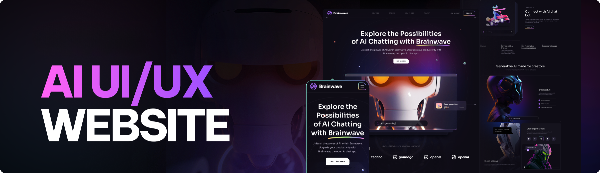

# Brainwave Website
 A Modern Generative-AI UI/UX Design Website
 
 

**Brainwave** - Modern UI/UX website, developed using React.js and Tailwind CSS, exemplifies modern UI/UX principles. Its sleek design, seamless animations, and overall user experience set a high standard.

## Tech Stack
- **Vite**
- **React.js**
- **Tailwind CSS**

## Features

 - **Beautiful Sections**: Includes hero, services, features, how to use, roadmap, pricing, footer, and header.

 - **Parallax Animations**: Engaging effects triggered by mouse movement and scrolling.

 - **Complex UI Geometry**: Utilizes Tailwind CSS for intricate shapes like circular feature displays, grid lines, and side lines.

 - **Latest UI Trends**: Incorporates modern design elements such as bento grids.

 - **Cool Gradients**: Enhances visuals with stylish gradients using Tailwind CSS for cards, buttons, etc.

 - **Responsive**: Ensures seamless functionality and aesthetics across all devices.